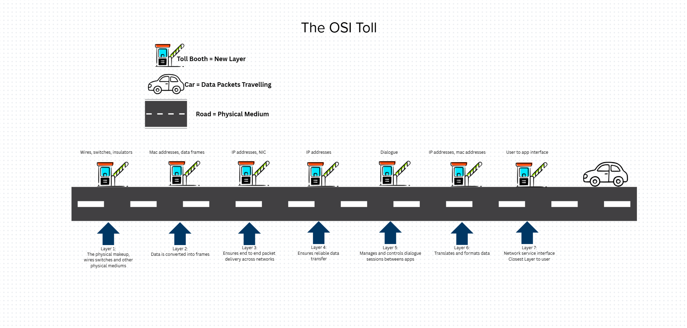

### Data Movement and Types of Networks

## LANS

Local Area Networks are networks on a small scale. These networks connect devices and routers within a building or campus. The devices that the LAN connects are called Hosts, and each Host is a device that can send or recieve data within the LAN and has a unique IP address. In order to establish efficient connections between these devices, switches are used to connect them all. Routers are what connects the LAN to other networks through the cloud. Routers are also considered gateway devices as every packet that enters a LAN has to go through the router first. Every device on the LAN has an IP address. Portions of the IP address are the same to signify being on the same network connected to the same router. Packets are data that travels throughout and to the devices in the LAN. Data does not travel in a stream however, data travels in chunks. 

Local Area Networks or LANS can be looked at as a neighborhood.

Computers and other endpoint devices are the houses as they are the different destinations that data can travel to

Ethernet Cables and WiFi are the roads as they allow the data to travel from destination to destination

Switches are like roundabouts because they provide multiple exits for data to travel to from one entrance point

Routers are the Post offices on the edge of town because they are the gateways to your network deciding which mail (data) should stay local and what needs to be pushed out to the cloud

Data is the mail or packages being sent to and from the house with a destination and return address

In order to visualize LANS, network maps were created...

It is important to note that there are arrows pointing in both directions in between each device in the network map. This is due to the fact that data is never just sent to a device, confirmation or responses are always sent back reporting package percentage loss.

This information is from the Lan Components Activity

## Binary

All digital data is sent through binary. Binary has two different states: on or off. These two states are determined either by a 1(on) or a 0(off). 
Computers use this on/off to create and store:
- IP addresses
    - Ip addresses have 4 parts (octets)- each octet is 8 bits... 192.8.1.1

- MAC addresses
- Packets

Each binary digit is called a bit. 

8 bits = 1 byte

4 bits = 1 nibble

Example conversion: 192.8.1.1

2^7: 128  2^6: 64  2^5: 32  2^4: 16  2^3: 8  2^2: 4  2^1: 2  2^0: 1

Binary is a composition of 8 characters either 1's or 0's. If there is a 1 in place of a value then that value is added to the total. the furthest left spot corresponds to 128, if there is a 1 in that spot then add 128 to the toal. an example of this would be 10000000, the total value of that would be 128 as the only 1 is in the 128 spot. 

1: 00000001

8: 00001000

192: 11000000

## Hexadecimal

Hexadecimal unlike binary is base 16.

ex. 11000000101010000000000100000001

ex. converted to hexadecimal C0A80101

Each hex digit is = to 4 bits

Hexadecimal goes in order 1-9 then letters A-F which is 16 different charecters

This information is from the Converting between Binary and Hexadecimal Activity

## OSI Model

The OSI model has seven layers that data travels through when it is sent across networks.

Notice that the numbers move in reverse order, this is due to the fact that data moves from bottom to top through the OSI model. Using the OSI model, someone can effectively troubleshoot networking issues as if all of these layers are functioning then the data is being transmitted effectively over the network. 

7. Application- The user/computer interaction such as an email or browser
6. Presentation- When the data is translated through encryption and compression
5. Session- Manages connection
4. Transport- Breaks data into segments or packages
3. Network- Routes packets using IP addresses
2. Data Link- Transfers frames via MAC, transmits raw bit streams over the physical medium
1. Physical- wires, signals, switches, wi-fi

An way to remember these letters is P.lease D.o N.ot T.hrow S.ausage P.izza A.way

Another way to visualize the OSI model is through a Road Map project

In this visualization, each toll is a different layer of the OSI model. This roadmap shows how data moves from layer 7 to layer 1. The most important layer is layer 7 because if the request is not right then none of the rest can be correct. This helps someone understand the connections between TCP and OSI to see the similarities at the application layer of the TCP model.

These cards display the different layers and their functions as well as possible uses for each layer. The picture above displays an attempt to orient the cards in the correct order. The picture below displays the correct orientation for the cards.

| TCP/IP Layer   | Corresponding OSI Layers| Functions             |
|----------------|-------------------------|-----------------------|
| Application    |5-7                      | Apps, HTTP, FTP       |
| Transport      |4                        | TCP/UDP, segmentation |
| Internet       |3                        | IP addressing routing |
| Network Access |1-2                      | Physical/Data link    |

This information came from the Data Movement Student Notes

## Virtual Machine Networking Lab

In order to view your IP address on the Mac terminal, type ip a

In the en1 section under inet is the IP address of the device like so:

The example IP can be seen in the screenshot above: 10.12.16.220

Using this IP address, on another device on the same network ping the IP address to test connectivity between the two devices. If the packets transmitted=packets received with 0.0% packet loss then the two devices have an established connection.

The 'netstat -a' command allows the user to view transport-layer information(layer 4), revealing open ports and active protocols:

Once a connection between the two devices is confirmed, the user can use a 'netstat -1 4444' command one one and a 'nc IP Address' to communicate between the two devices like so:

## Reflection

All of this information can better ones understanding of how data travels through a network. When a user sends data through a network it is import to understand the process it goes through. Data is always sent and received in a LAN meaning it traverses up and down the OSI model layers. Computers understand data in the form of bits, bytes and nibbles. Information is converted from binary to hexadecimal or vise versa to allow a computer to know where to send it on a network. IP addresses are converted into 1s and 0s so that a device sends data to the right place. It is also important to know how to see a devices IP address in the terminal using the 'ip a' command in the event that it needs to be manually configured. 

