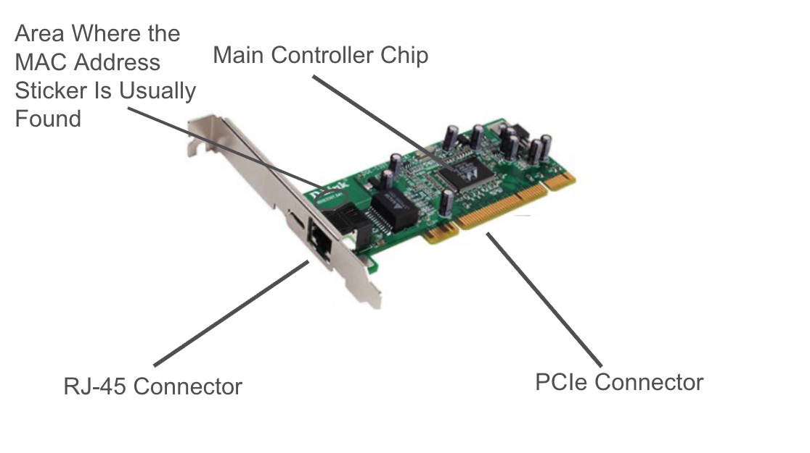

## Physical Addressing and Logical Addressing

In order to begin this activity, first understand a MAC address. Every computer has a hardware network card called a NIC. Each NIC is assigned a permanent hardware identifier when it is manufactured. This identifier is the MAC address or Media Access Control Address. Think of this address as the computers "serial number". 

In order to better understand NICs, diagrams were created:

The MAC address labeled on the images serves as a destination address for devices sending data to that device. The RJ-45 port is for ethernet cables for a direct network connection between the device and a router. The PCIe connector is needed to power the NIC as well as data transfer. The "main chip" of the NIC is needed for sending and receiving frames. 

“Why is a MAC address considered a physical address, and how does seeing a real NIC help you
understand this?”

Answer: A MAC address is printed on the NIC, it is determined at the factory when the NIC is created.

MAC addresses are 12 charecters long

example MAc address: 62:d9:a1:34:e0

The first three pairs of the MAC address represent the OUI (Organizationally Unique
Identifier) - 62:d9:a1

Summary:

MAC addresses are determined when the NIC is created and are printed on the NIC. The MAC address in the VM is virtualized therefore not able to be located by the website https://maclookup.app/. A virtual NIC still requires a MAC address for data tranference. 

| Full MAC Address | OUI    | Vendor   | Type of Vendor | Notes| 
|------------------|--------|----------|----------------|------|
|F0:18:98:AA:BB:CC |F0:18:98| Apple    |
|3C:5A:B4:11:22:33 |3C:5A:B4| Google   |
|60:45:BD:12:34:56 |60:45:BD| Microsoft|
|A4:BA:DB:22:33:44 |A4:BA:DB| Dell     |
|04:1A:04:55:66:77 |04:1A:04| WaveIP   |
|00:50:56:AA:BB:CC |00:50:56| VMware   |
|52:54:00:12:34:56 |52:54:00| Noinfo   |
