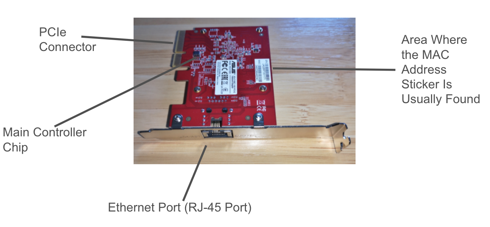

## Physical Addressing and Logical Addressing

In order to begin this activity, first understand a MAC address. Every computer has a hardware network card called a NIC. Each NIC is assigned a permanent hardware identifier when it is manufactured. This identifier is the MAC address or Media Access Control Address. Think of this address as the computers "serial number". 

In order to better understand NICs, diagrams were created:

The MAC address labeled on the images serves as a destination address for devices sending data to that device. The RJ-45 port is for ethernet cables for a direct network connection between the device and a router. The PCIe connector is needed to power the NIC as well as data transfer. The "main chip" of the NIC is needed for sending and receiving frames. 

“Why is a MAC address considered a physical address, and how does seeing a real NIC help you
understand this?”

Answer: A MAC address is printed on the NIC, it is determined at the factory when the NIC is created.

MAC addresses are 12 charecters long

example MAc address: 62:d9:a1:34:e0

The first three pairs of the MAC address represent the OUI (Organizationally Unique
Identifier) - 62:d9:a1

Summary:

MAC addresses are determined when the NIC is created and are printed on the NIC. The MAC address in the VM is virtualized therefore not able to be located by the website https://maclookup.app/. A virtual NIC still requires a MAC address for data tranference. 

| Full MAC Address | OUI    | Vendor   | Type of Vendor | Notes                           | 
|------------------|--------|----------|----------------|---------------------------------|
|F0:18:98:AA:BB:CC |F0:18:98| Apple    | Physical       | Contains doubles like AA, BB, CC|
|3C:5A:B4:11:22:33 |3C:5A:B4| Google   | Physical       | Patterns like 11, 22, 33        |
|60:45:BD:12:34:56 |60:45:BD| Microsoft| Physical       | No noticed patterns             |
|A4:BA:DB:22:33:44 |A4:BA:DB| Dell     | Physical       | Patterns like 22, 33, 44        |
|04:1A:04:55:66:77 |04:1A:04| WaveIP   | Virtual        | Patterns like 55, 66, 77        |
|00:50:56:AA:BB:CC |00:50:56| VMware   | Virtual        | Patterns like AA, BB, CC        |
|52:54:00:12:34:56 |52:54:00| Noinfo   | N/A            | No noticed patterns             |

**Notice the physical vendors have some patterns within the MAC address such as repeating numbers or letters. Virtualization vendors also need registered OUIs because if not then they could accidentally replicate real OUIs. This activity helps the user understand MAC addresses at layer 2 by explaining how they are assigned and how devices use these to send data across networks.**

The information in the chart above was found using the website https://maclookup.app/search/result?mac=F0:18:98:AA:BB:CC like so:

Using the Ubuntu MAC address above (62.d9.a1.34.e0.a7) users can identify the different parts of the address.

The OUI is the first three pairs (62.d9.a1) while the Device Identifier is the last three pairs (34.e0.a7). The OUI represents the first 24 bits of the MAC address and identifies the vendor. The OUI connects the NIC to the manufacturer because every OUI is registered with IEEE which allows the network to recognize who produced the NIC. The OUIs must be unique or address duplication would occur and data transference would not me secure. A MAC address needs a unique second half for the same reasons. This prevents each device from having a different MAC address by creating distinct front halfs and back halfs. Otherwise these addresses would confuse switches and routers trying to send data to a certain address that has two devices linked to it. 

Revisiting the images of the NIC diagrams, notice that MAC addresses are physically printed on the NIC. VM's create its MAC address by hiding behind the address of the desktop computer. Physical and Virtual MAC addresses both have to remain unique from one another, however physical address vendors are created by the VM's manufacturer. 

## Reflection

This activity dives into the ins and outs of MAC addresses. It explains how each MAC address is different from the other in order to prevent data sending and receiving issues. In addition, it covers how to divide MAC addresses into two sets of three (The front half and the back half) in order to reveal OUIs and other identifiers. All of this information is printed in the form of a MAC address on the NIC card inside the device. The MAC address of the NIC is determined at the factory when it is created. 

This information came from the UnderstandingPhysicalAddressing assignment. 
