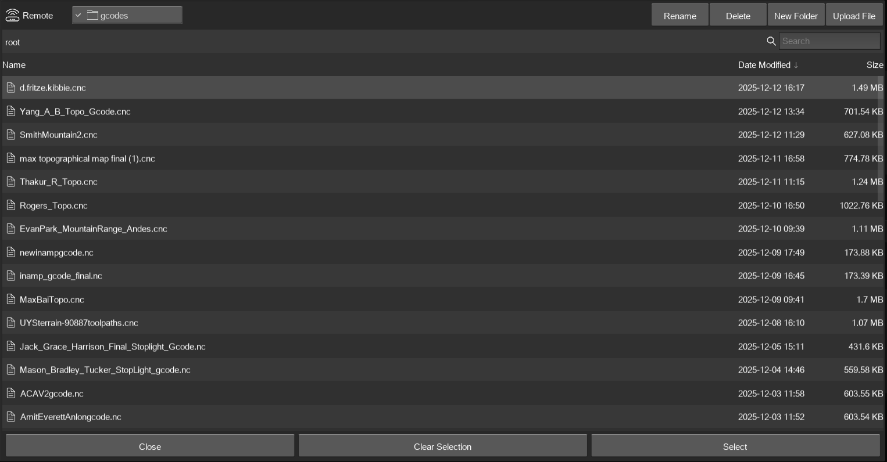
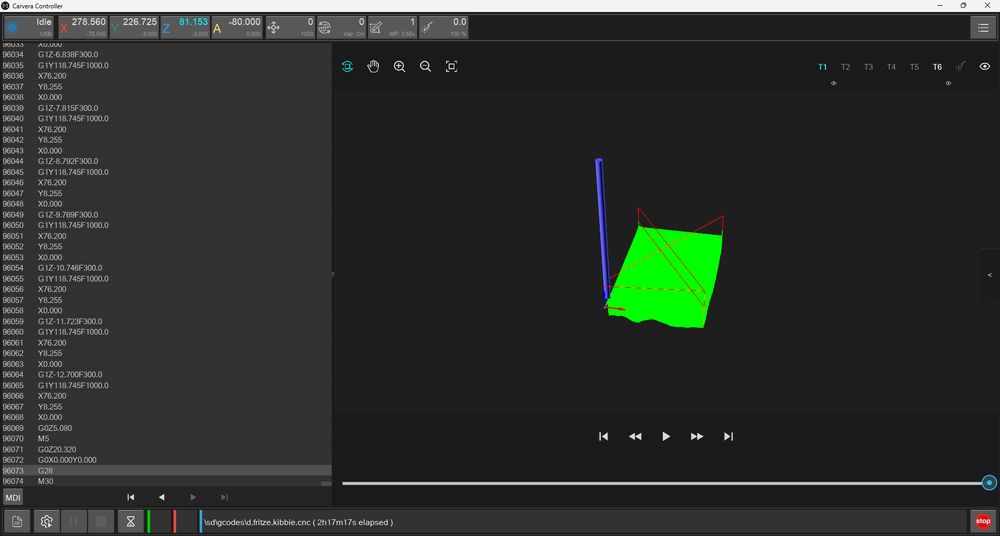
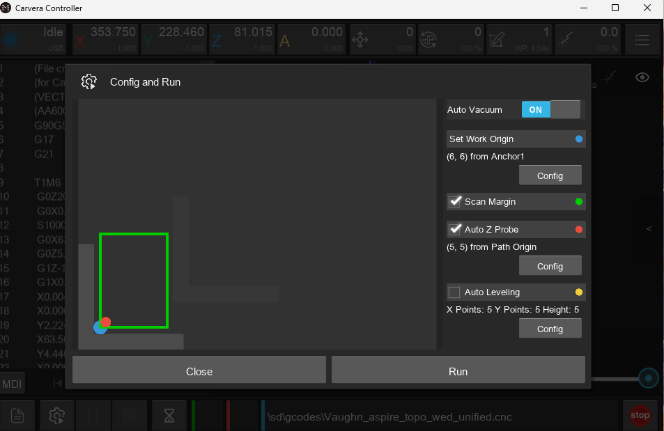
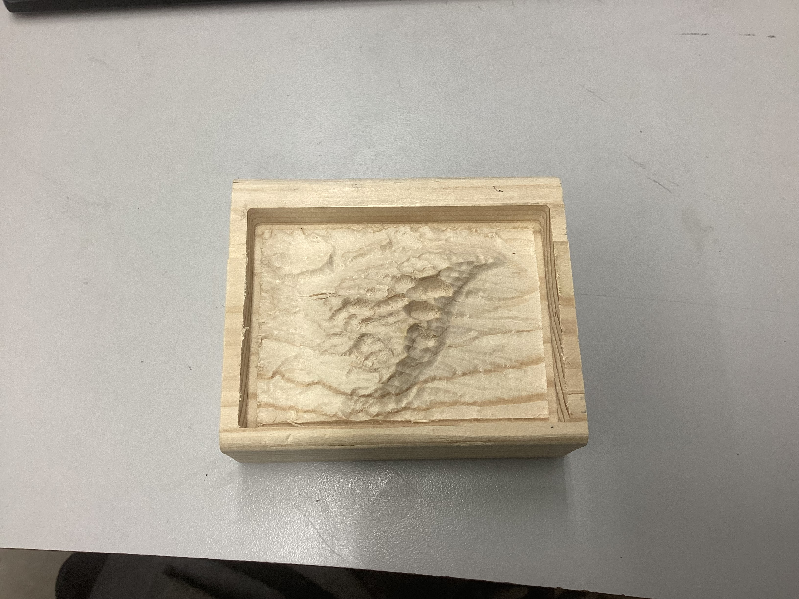

### Topography Map Documentation

This is the steps for creating a topography map with Aspire and milling it out on a Cavera CNC machine.

## Design Phase

This workflow was provided by my instructor Mr. Tom Dubick:

Access the Website:

Navigate to https://jthatch.com/Terrain2STL/.

2. Find Your Location:

Use the map interface. You can click and drag to pan the map to the geographical area you are
interested in. Under Location, Click on Center to View. This will create a red box.

3. Define the Model Area:  below)

A red box on the map shows the area that will be turned into a 3D model.

○ To Move the Box: Click and drag the red box to the exact location you want.

○ To Resize/Rotate the Box: Use the sliders in the "Model Details" section (Box Width, Box
Height, Box Rotation) to adjust the shape and orientation of your selection.

4. Adjust Model Settings:

Before generating the model, you can fine-tune the settings in the "Model Details" and "Water and
Base Settings" sections:   below)

○ Vertical Scaling: This slider (also called Z-Scale) exaggerates the height (mountains, valleys)
of the terrain. A higher value makes the vertical features more pronounced. It is recommended
to start with the default of 1 and adjust as necessary from there.

○ Water Drop (mm): This lowers the height of water bodies (like oceans) to make coastlines
stand out more. If you have water, it is recommended to start with the default of 0 and adjust as
necessary from there.

○ Base Height (mm): This adds a solid base underneath the terrain model, ensuring it's a solid,
printable object. It is recommended to start with the default of 1 and adjust as necessary from
there.

5. Generate the Model:   
Once you are satisfied with your selected area and settings, click the Generate Model button. The
website will process the terrain data. The Generate Model button will begin generating and

downloading your terrain .STL file as a .ZIP file.

Part 2: Aspire Vectric 12.5 and Makera Cavera ATC

Phase 1: Job Setup & STL Import

(CAD: Computer Aided Design)

This phase is about preparing your workspace and bringing in your 3D model.

1. Create New File: Open Aspire.

2. Define Material: 

a. Set the Job Type to Single Slided.

b. Set your Job Size (X, Y) to match your physical stock. The X axis is to the right and left of the
bed while the Y axis is to the back of the Carvera machine when looking at the bed.

c. Set your Thickness (Z). This is critical. Your imported STL model's height cannot be thicker
than this value. [As a general rule, this value should be the height (thickness) of your stock.]

3. Set Zero Origin:

a. Z Zero Position: Material Surface (top) for the Cavera.

b. XY Datum Position: BottomLeft is often easiest when working with a single 3D model, as it
helps you center the component easily.

4. Set Model Resolution:You can set the resolution to High or Very High for best 3D quality, but the
software will run slower. It is okay to leave the resolution at Standard (fastest).

5. Click OK.

6. Import 3D Model:

a. Go to the Modeling tab (the one with the blue/green shapes).

b. Click the "Import a Component or 3D Model" icon (looks like a folder with a blue arrow).

c. Select your .stl file.

7. Orient 3D Model -

a. Imported 3D Model > Transform

i. This is the most important step for an STL
workflow. A new 3D orientation window will appear.

ii. Initial Orientation: Set the Initial Orientation to Top.
Leave the Rotation about Z Axis at “0” or change
it to move the orientation of your 3D model.

iii. Model Size: Adjust the model's Width, Height, or
Depth. Use the "Lock" icon, which needs to be
unchecked, to change the X, Y, and Z sizes
individually to the stock size. Use the
appropriate size for your stock. In our example, the
stock is 1”. [As a general rule, the Z height should
be less than or equal to the thickness of your stock
for the Carvera.]

iv. Click Apply and then Center Model.

v. Apply Perspectiver along Z: Ignore. Leave it
unchecked. Click Position and Import>.

b. [Beginner]-Import 3D Model (.stl file) > Position:

i. Next, using the
slider bar position the
model Depth Below
above the purple
horizontal cutting
plane. In other
words, make sure that
your model’s Z
height size is equal to
the Depth Below
size (Red circles
below).

ii. Using the view cube in
the top right corner of
the screen, Click on the
FRONT VIEW to see
the view of your
model compared to the cut line.

The pictures below are for your conceptual understanding, but these are separate images. You will NOT see
these all together.

iii. Click Import while on the Position relative to the Modeling Plane.

c. [Advanced] - Import 3D Model (.stl file) > Position:

i. Next, using the slider bar,
position the purple
horizontal cutting plane
at the appropriate depth
to maximize the vertical
relief of your model while
maintaining a
reasonable base height
of the model. In other words,
make sure that your model’s
Z height size is slightly
below the lowest relief point of
your model. (Red circles below).

ii. Using the view cube in the top
right corner of the screen,
Click on the FRONT VIEW
to see the view of your model
compared to the cut line.

iii. Again, using the view cube,
adjust the view cube to an
isometric view to be able to
view your model to be sure
you are not cutting away
part of the bottom relief 

Your STL file is now imported as a single 3D "Component" in your Component Tree. You will see it in the 3D
view.

Phase 2: Sizing your Component
Now you must position the 3D model towards the top of the stock.

1. Click on the Component tab:

○ Click on the name of your .STL file name to access the Component Properties.You may need
to right click on the name of the imported .STL file that is under Level 1 below the Components
section. You can also access this by right clicking then selecting the Properties.

○ Click the "Shape Height" and change the value to 1.0. This will make the Z height of your
model more pronounced. Next, Click the "Base Height" and change the value to 0.25. This will
raise the height of your imported model in the material so that it is closer to the top of stock

○ Click close.

Phase 3: Positioning & Creating a Boundary
Now you must position the 3D model within your material and tell Aspire the exact area you want to machine.

2. Position the Component:

○ Switch to the Design tab. Now click on the 2D view.

○ Click the Alignment Tool (under Transform Objects). Click the "Center" tool. This will perfectly
center your imported model in the material you defined in Phase 1.

○ Click Close

3. Create a Boundary:

○ While on the 2D view go to the Create Vectors section under Design.

○ Click the " Draw Rectangle" icon.

○ You will create a rectangle around the boundary of your model. This rectangle will be the size of
your stock, such as 2.5” (X) by 3” (Y).

○ Why this is crucial: This profile is what you will use to trim your finished product.

Phase 4: 3D Toolpath Generation (CAM: Computer Aided Manufacturing)
This is where you create the actual cutting instructions. For a 3D model, this is almost always a two-part
process: a "Roughing" pass and a "Finishing" pass.

1. Switch to the Toolpaths Tab (top right). 

2. Select Your Boundary: In the 2D view, click on the 3D model image.

3. Pin the Toolpaths Tab Open using the "pin" icon so it doesn't close.

Step 4A: The 3D Roughing Toolpath (Clearing Material)

The goal here is to quickly remove the bulk of the "unused" material with a large, strong
bit.

1. Click the 3D Roughing Toolpath icon.

2. Tool: The Material needs to be set to Hardwood. Select a large 25 mm Flute
End Mill (3.175 mm) under the Carvera Tools subsection Example Tools. This is
also known as 1/8” End Mill. This is set to Tool Number 1 for the ATC. 

3. Machining Limit Boundary: Select Selected Vectors. This tells Aspire to only
machine the area inside the vector you have selected.

4. Machining Allowance: Set a small value (e.g., 0.024"). This leaves a thin "skin"
of material for the finishing bit to clean up, preventing it from "chattering" or
breaking.

5. Strategy: Choose Z Level (efficient for "stairstepping" down) or 3D Raster (good
for flatter models).

6. Name your toolpath (e.g., "3D Rough - 0.25 Endmill or 25 mm Flute End Mill")
and click Calculate.

Step 4B: The 3D Finishing Toolpath (The Detail Pass)

The goal here is to use a small bit to slowly go over the entire model, creating
the smooth, detailed final surface.

1. Click the 3D Finishing Toolpath icon. (Your boundary vector
should still be selected).

2. Tool: The Material needs to be set to Hardwood. Select a small 1⁄8” Ball
Nose bit. The smaller the bit, the more detail you get, but the longer it
takes.This is set to Tool Number 6 for the ATC. 

3. Machining Limit Boundary: Again, select Selected Vectors.

4. Strategy:

○ Raster: A good, all-around strategy. Set the Raster Angle (e.g., 0
degrees) to go back and forth along the X-axis.

○ Offset: Good for models that are circular or oval.

5. Name your toolpath (e.g., "3D Finish - 0.125 Ballnose") and click
Calculate. (see image to the right)

Phase 5: 2D Profile Toolpath Generation (CAM)
This is where you create the actual cutting instructions. For a 3D model, this is almost always a two-part
process: a "Roughing" pass and a "Finishing" pass.

1. Select Your Boundary: In the 2D view, click on the rectangular model profile.

2. Toolpaths: Select the 2D Profile Toolpath.
The 2D Profile Toolpath

3. Click the 2D Roughing Toolpath icon.

4. Cutting Depths: Make the Star Depth 0 and the Cut Depth 0.5. This tells Aspire to
only machine the specific depth.

5. Tool: The Material needs to be set to Hardwood. Select a large 25 mm Flute End
Mill (3.175 mm) under the Carvera Tools subsection Example Tools. This is also
known as 1⁄8” End Mill. This is set to Tool Number 1 for the ATC. **Found that the toolpaths will not save to one file if the tools are not all under the cavera section**

6. Machine Vectors: Select On the line and the Direction of climb.

7. Do Separate Last Pass: Ignore it. Leave it unchecked.

8. Add tabs to toolpath: Not Needed.

9. Name your toolpath (e.g., "2D Profile - 1⁄8” Endmill" or 25 mm Flute End Mill) and click Calculate. 

Phase 6: Simulation & Exporting

1. Preview ALL Toolpaths :

○ This is your most important safety check. Click the Preview all
Toolpaths button. 

○ Aspire will run a full 3D simulation. First, you'll see the Roughing
pass "hog out" the material in steps. Then, you'll see the
Finishing pass clean it up. You can preview each file
independently, together, etc. 

○ Check for errors: Does it look correct? Did you miss any
spots? Is the detail what you expected?

○ Toolpaths Summary : Click on the Toolpaths Summary
icon to learn how long your total machining time will take to
complete your file.
2. Save Your Project File: While u Go to File > Save As... and save your
.crv3d project file. This saves all your work you have completed as an
Aspire VCarve file to the computer. 

3. Save Your G-Code (Toolpath Files):

○ Click the Save Toolpaths button (floppy disk icon).

○ This workflow creates Visible toolpaths to one file for your
machine.

○ Check Toolpaths: Select "3D Rough," then select "3D Finish",
and then select “2D Prolfie”. -> Click Save Toolpath(s).

○ Choose your Machine -> Carvera Desktop CNC Machine.

○ Choose your Post-Processor( the "driver" for your Carvera ATC
CNC machine) → Carvera ATC (mm) (*cnc) -> Click Save
Toolpath(s). This will save the .gcode as a .cnc Makera Carvera
file to the computer.
○ You will now have the .gcode (or .nc, etc.) file to run at your CNC
machine, as a file that will automatically run each toolpath one
after another.**Ended up with a .cnc file**

**The bolded segements were the modifications on this project**

## Milling Phase

Open up Cavera controller

In the bottom right corner of the controller screen click on the file icon to upload your .cnc file from the steps before

After the file has been uploaded Switch to the display interface

Ensure auto leveling is on

Run the cnc code

Ensure that when the machine picks up the probe device that a red dot appears below the probe

Finished product:

[.cnc File Link](assets/css/Rogers_Topo.zip)

## Reflection

This project taught me how to use aspire to create designs and mill them out on a Cavera CNC machine. Some issues that I encountered during this projet were that at the start we were given incorrect dimensions. Without the correct dimensions, a user could potentially set the cut depth too low and drill into the bed of the machine. Another issue was the file format to upload into the cnc machine. We were unsure whether the file format should be a .ncgcode or .cnc, however, we discovered that the .cnc is the correct format. The last issue encountered was that when I selected the tools for the roughing tool path I selected the correct tool and size but not under the cavera tools section. This led to an error when trying to save all my toolpaths to one file. After asking flint ai I discovered my issue and changed the tool. After that the toolpaths saved and I was able to mill my topography map. 
