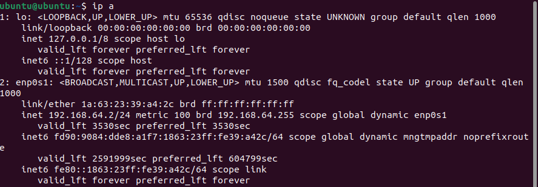
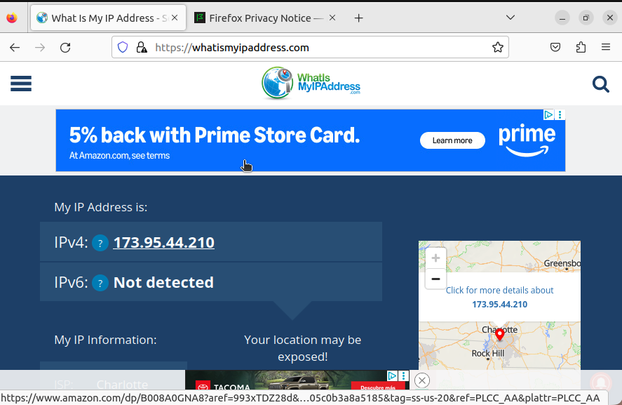

## Exploring IP Addresses

In order to start exploring IP addresses, run the 'ip a' command in the Ubuntu VM

The output should look something like this:

Under enp0s1 is the inet followed by the IP address of the VM: 192.168.64.2

Another method of locating a devices IP address would be to visit the website https://whatismyipaddress.com

The outputted screen should look something like this:

The sites detected IPv4 address can be seen in the image above: 173.95.44.210. This IP address is different from the one found earlier using the 'ip a' command due to the fact that each device has an internal and external IP address. The external IP address is how devices outside the LAN detect it. The internal IP address is how devices within the same network detect and send data to it. By using a VM in shared mode, the VM "hides behind" the IP address of the computer. In doing so, the VM conserves IP addresses and acts as a router allowing multiple VM's to communicate through one IP address. 

