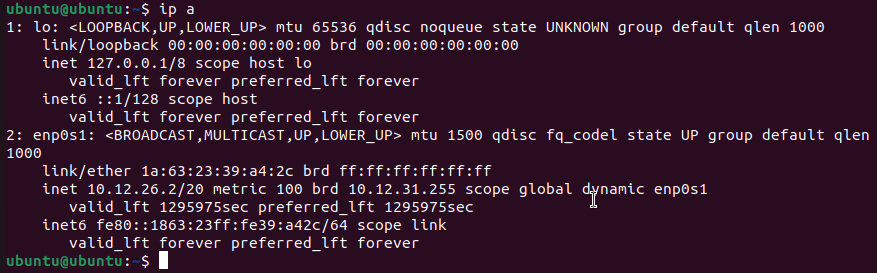
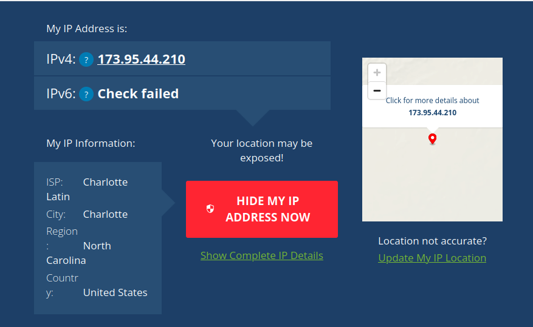
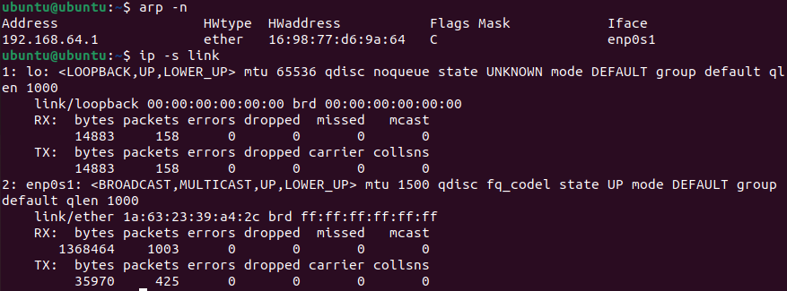
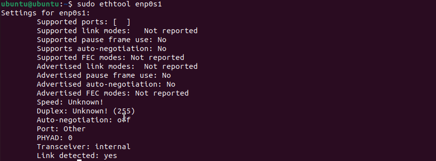
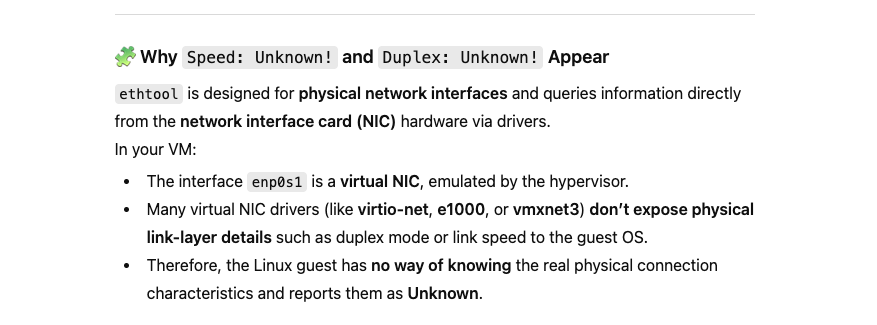
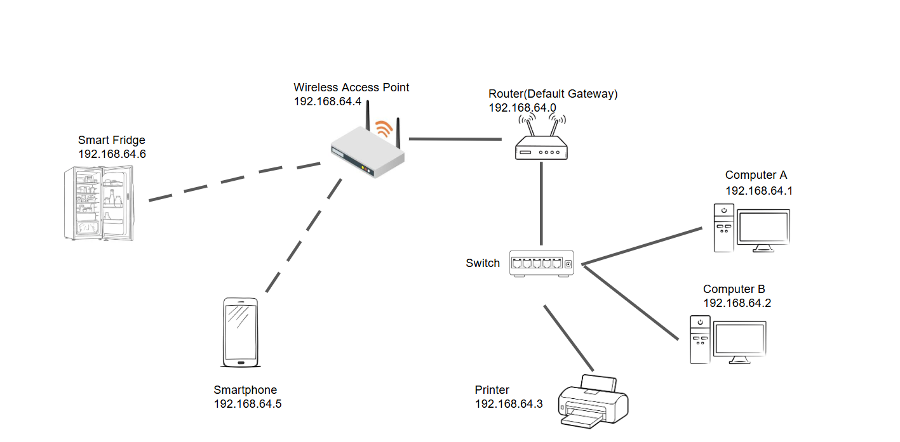
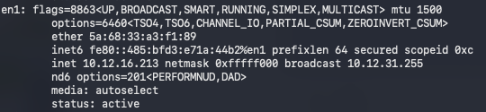
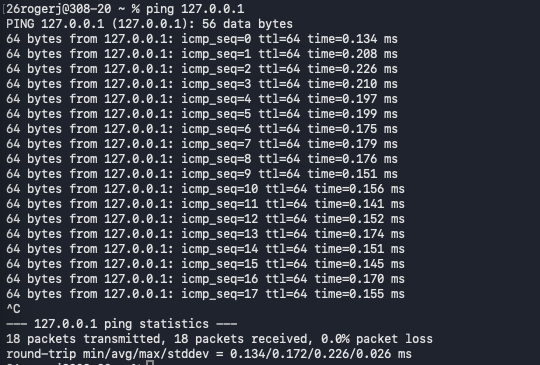
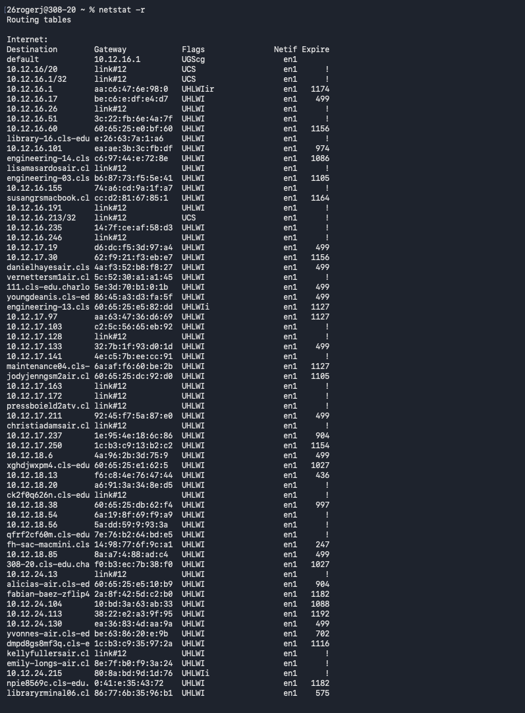

## Exploring IP Addresses

In order to start exploring IP addresses, run the 'ip a' command in the Ubuntu VM

The output should look something like this:

Under enp0s1 is the inet followed by the IP address of the VM: 192.168.64.2

Another method of locating a devices IP address would be to visit the website https://whatismyipaddress.com

The outputted screen should look something like this:

The sites detected IPv4 address can be seen in the image above: 173.95.44.210. This IP address is different from the one found earlier using the 'ip a' command due to the fact that each device has an internal and external IP address. The external IP address is how devices outside the LAN detect it. The internal IP address is how devices within the same network detect and send data to it. By using a VM in shared mode, the VM "hides behind" the IP address of the computer. In doing so, the VM conserves IP addresses and acts as a router allowing multiple VM's to communicate through one IP address. 

Now switch to the bridged mode of the VM and run the same 'ip a' command again

At this point when the 'ip a' command is ran the internal IP address may not appear. This is due to an ethernet connection in Bridged mode. Exit the VM and switch the "Bridged Interface" from automatic to en1.

Now the internal IP address should appear under enp0s1 like so:

Now to find the external IP address go back to https://whatismyipaddress.com using firefox on the VM. A common error when trying to run programs on the VM is that they will not open or function properly unless the 'sudo apt update & sudo apt upgrade' commands are ran. After this the outputted screen should look like this:

This next portion reviews how computers connect to other devices at the first two layers of the OSI model (Physical and Data link)

Using the ubuntu vm, type 'sudo apt install ethtool -y' in order to install the ip link commands.

Next run the 'ip link show' command to reveal the MAC address of the device. The outputted screen should look like this:

The Mac address of the device corresponds to the NIC inside of the device. The MAC address is a unique hardware device that is like a nametag for data being sent to it. 

Next, by running the 'arp -n' and 'ip -s link' commands a user can view network activity. The 'arp -n' command reveals the IP and MAC addresses of the devices that the computer has been comunicating with. The commands should reveal a screen like this: 

By running the 'sudo ethtool enp0s1' command the user can view how the device connects at the Physical layer.
The Outpputed screen should look like this:

In the image one can see that Duplex is listed as "Unknown!". This is due to the fact that the VM is not able to directly communicate with the built-in hardware NIC. AI supports this claim below:

This information came from the Exploring IP Addresses in Shared and Bridged Mode Activity

## Ethernet Cable Construction 

## TCP/OSI Networks

Next lets ping google by using the 'ping -c 3 goog.com' command. Note that if this command does not work but 'ping -c 8.8.8.8' command does then there is an issue with the devices DNS. The outputted screen should look like this:

After that lets run the 'ip link show' command to view the actice interface

**Note in this image**

The Interface Name: lo

The MAC Address: 1a:63:23:39:a4:2c

The Broadcast Address: ff:ff:ff:ff:ff:ff

Now run the 'arp -n' command to see the IP address and MAC address of the devices that the VM has communicated with:

Next the 'ip -s link' command reveals the RX packets, TX packets and any errors:

Finally run 'sudo tcpdump -c 5' command in order to capture five live packets travelling through the interface:

All devices on the same network identify under the same network interface. MAC addresses, unlike IP addresses, identify the hardware of the device so packets know where to go. ARP connects layer 2 and 3 so the computer knows where to send data physically. Live packets all have the same default gateway because they are devices on the same network with the same router. Layers 1 and two work together to physically and virtually send data across networks.

## SOHO Networks

SOHO Networks are small office/home office networks. They typically are composed of only a few devices including a router and desktops. In order to better understand SOHO networks, diagrams were created:

Notice that all the IP addresses have a starting three octects of 192.168.64.x. This is due to the fact that all the devices on this network have the same router or default gateway. 

Now to better view how these two devices are connected, grab a partner and test the IP addresses on each partners computer using the 'ip a' command in Ubuntu or 'ifconfig' in Mac terminal. Partners must be using different terminals due to the fact that both partners would have the same IP address if they are on the Ubuntu VM. The outputted screen of the 'ip a' command should look like this:

Next, test the connection between the two devices by running 'ping *Partners IP adress* ' 

The terminal should send and recieve packets will 0.0% package loss signaling a secure connection:

Next lets review the 'netstat -r' and 'arp -a' commands. 

The 'netstat -r' command corresponds to the network layer (layer 3) as it displays the devices routing table and how data is sent throughout the network. 

The 'arp -a' command corresponds to data link layer (layer 2) as it displays the devices mac address table. 

